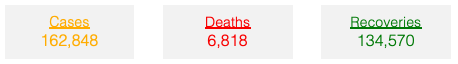
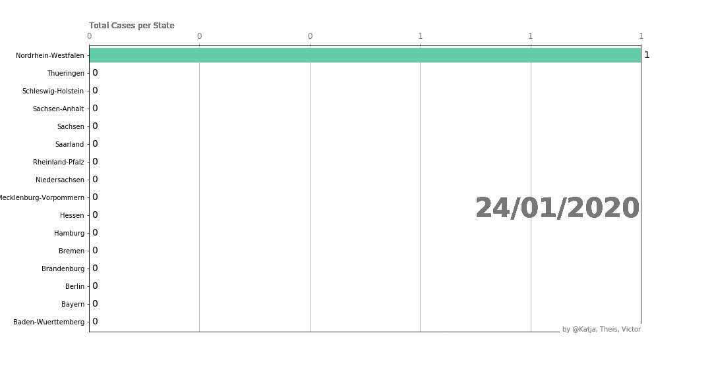

# Newest covid-19 updates on Germany.

### Get a quick and easy overview of Germanys situation and se how the virus has spread out since the first outbreak were registered on Januray 28, 2020 in the state of Bavaria. 
The graphs and visualisations presented in this report are based on data obtained from this [site](https://www.kaggle.com/headsortails/covid19-tracking-germany?fbclid=IwAR2ouNxb53Z-Mk4emTUpdZog9Uhm02krlCW0yC4woPArAbeF2lt5HyraS-4#covid_de.csv).

Many visuals include userfriendly navigation, which involves zoomability by marking an area and toggling values on and off in the legend. The most important icons are , which resets the zoom of the graph and  which respectively shows single value of the line hovered or all values for the date hovered. 

<h3 align="center">
Total
</h3>

  

<h3 align="center">
Per one milion inhabitant
</h3>

  

<h3 align="center">
Development of total cases, deaths and recoveries
</h3>
<iframe src="https://theisgregersen.github.io/Covid-19-DE/overview_cum.html" sandbox="allow-same-origin allow-scripts" width="100%" height="500" scrolling="no" seamless="seamless" frameborder="0"> </iframe>

## Test af Victor

<figure>
  
  <figcaption align="center" style="font-size:11px"> Number of Cases per State over Time.</figcaption>
</figure>

Lorem ipsum dolor sit amet, consectetur adipiscing elit, sed do eiusmod tempor incididunt ut labore et dolore magna aliqua. Ut enim ad minim veniam, quis nostrud exercitation ullamco laboris nisi ut aliquip ex ea commodo consequat. Duis aute irure dolor in reprehenderit in voluptate velit esse cillum dolore eu fugiat nulla pariatur. Excepteur sint occaecat cupidatat non proident, sunt in culpa qui officia deserunt mollit anim id est laborum.

---

## Slut test Victor

<h3 align="center">
Total infected Heatmap 
</h3>
<figure>
<iframe src="https://theisgregersen.github.io/Covid-19-DE/heatmap_DE.html" sandbox="allow-same-origin allow-scripts" width="100%" height="500" scrolling="no" seamless="seamless" frameborder="0"> </iframe>
  <figcaption align="center" style="font-size:12px"> Indsæt caption.</figcaption>
</figure>

<h3 align="center">
Registered infected over weeks
</h3>

Tjek om index=dato virker (Victor). Fiks hvordan interaktiv bar ser ud.
<figure>
<iframe src="https://theisgregersen.github.io/Covid-19-DE/heatmap_time.html" sandbox="allow-same-origin allow-scripts" width="100%" height="500" scrolling="no" seamless="seamless" frameborder="0"> </iframe>
  <figcaption align="center" style="font-size:12px"> Indsæt caption.</figcaption>
</figure>

<h3 align="center">
See if your country is fucked (R0 plots)
</h3>
<figure>
  

<h3 align="center">
Regulations in trying to prevent further spread
</h3>
  

As many other nations the german government tried to prevent Covid-19 spreading out of control by enforcing some regulations. In the visual below the five most important regulations are noted by date together with the data of daily occurences of Covid-19; both new cases, deaths and recoveries. It appears that around end March early April the number of new cases started declining and could be seen as an outcome of the initiatives taken by the government. On the 15th of April the government declared a small success in stopping the spread and immediately it can be seen there is a small increase in daily cases. This however, is not to be seen as a direct consequence of the announcement, as it usually takes more than a few days from catching the virus to showing symptons. The same pattern can be seen on the days following the 20th of April where shops again were allowed to open up. 

<iframe src="https://theisgregersen.github.io/Covid-19-DE/Overview_byday.html" sandbox="allow-same-origin allow-scripts" width="100%" height="500" scrolling="no" seamless="seamless" frameborder="0" title="A cute kitten"> </iframe>

According to [imperial](https://www.imperial.ac.uk/news/196573/covid-19-one-five-over-80s-need-hospitalisation) the deathrate is 0.66 % and the hospitalisation rate is 11.8 %. This is used in the visual below to estimate the number of hospitalised and the number of deaths. Using this [source](https://en.wikipedia.org/wiki/List_of_countries_by_hospital_beds) it has been determined that the number of available beds at hospitals for Covid-19 is 139,474.

Dropdown menu - R0-værdi 1

 
<iframe src="https://theisgregersen.github.io/Covid-19-DE/test1234.html" sandbox="allow-same-origin allow-scripts" width="100%" height="500" scrolling="no" seamless="seamless" frameborder="0"> </iframe>

Dropdown menu - R0-værdi 2?

 

<figure>
<iframe src="https://theisgregersen.github.io/Covid-19-DE/test1234.html" sandbox="allow-same-origin allow-scripts" width="100%" height="500" scrolling="no" seamless="seamless" frameborder="0"> </iframe>
 
   <figcaption align="center" style="font-size:10px"> Test of Figure Caption.</figcaption>
</figure>
  

Dropdown menu - R0-værdi 3?

 

<figure>
<iframe src="https://theisgregersen.github.io/Covid-19-DE/test1234.html" sandbox="allow-same-origin allow-scripts" width="100%" height="500" scrolling="no" seamless="seamless" frameborder="0"> </iframe>
 
   <figcaption align="center" style="font-size:10px"> Test of Figure Caption.</figcaption>
</figure>
  

