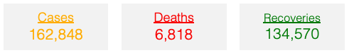

# Newest covid-19 updates on Germany.

### Get a quick and easy overview of Germanys situation and se how the virus has spread out since the first outbreak were registered on Januray 28, 2020 in the state of Bavaria. 
The graphs and visualisations presented in this report are based on data obtained from this [site](https://www.kaggle.com/headsortails/covid19-tracking-germany?fbclid=IwAR2ouNxb53Z-Mk4emTUpdZog9Uhm02krlCW0yC4woPArAbeF2lt5HyraS-4#covid_de.csv).

  

#### Development of total cases, deaths and recoveries
<iframe src="https://theisgregersen.github.io/Covid-19-DE/oversigtbyday.html" sandbox="allow-same-origin allow-scripts" width="1000" height="500" scrolling="no" seamless="seamless" frameborder="0"> </iframe>

#### See if your country is fucked
<iframe src="https://theisgregersen.github.io/Covid-19-DE/test1234.html" sandbox="allow-same-origin allow-scripts" width="1000" height="500" scrolling="no" seamless="seamless" frameborder="0"> </iframe>

 PAS PÅ!!

some **This is Red Bold.** text

Uhh,-nu-bliver-det-lækkert-plot
 

## "WOW!! HOLD NU OP" siger Sune om dette plot

<iframe src="/CasesPer100K.html" sandbox="allow-same-origin allow-scripts" width="100%" height="500" scrolling="no" seamless="seamless" frameborder="0"> </iframe>
