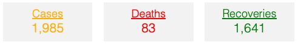

# Newest covid-19 updates on Germany.

### Get a quick and easy overview of Germanys situation and se how the virus has spread out since the first outbreak were registered on Januray 28, 2020 in the state of Bavaria. 
The graphs and visualisations presented in this report are based on data obtained from this [site](https://www.kaggle.com/headsortails/covid19-tracking-germany?fbclid=IwAR2ouNxb53Z-Mk4emTUpdZog9Uhm02krlCW0yC4woPArAbeF2lt5HyraS-4#covid_de.csv).

<h3 align="center">
Total
</h3>

  

<h3 align="center">
Per one milion inhabitant
</h3>

  

<h3 align="center">
Development of total cases, deaths and recoveries
</h3>
<iframe src="https://theisgregersen.github.io/Covid-19-DE/overview_cum.html" sandbox="allow-same-origin allow-scripts" width="100%" height="500" scrolling="no" seamless="seamless" frameborder="0"> </iframe>
<iframe src="https://theisgregersen.github.io/Covid-19-DE/Overview_byday.html" sandbox="allow-same-origin allow-scripts" width="100%" height="500" scrolling="no" seamless="seamless" frameborder="0"> </iframe>

## Test af Victor

  <select>
    <option value="0">Select car:</option>
    <option value="1">Audi</option>
    <option value="2">BMW</option>
    <option value="3">Citroen</option>
    <option value="4">Ford</option>
    <option value="5">Honda</option>
    <option value="6">Jaguar</option>
    <option value="7">Land Rover</option>
    <option value="8">Mercedes</option>
    <option value="9">Mini</option>
    <option value="10">Nissan</option>
    <option value="11">Toyota</option>
    <option value="12">Volvo</option>
  </select>

## Slut test Victor

<h3 align="center">
Total infected Heatmap 
</h3>
<iframe src="https://theisgregersen.github.io/Covid-19-DE/heatmap_DE.html" sandbox="allow-same-origin allow-scripts" width="100%" height="500" scrolling="no" seamless="seamless" frameborder="0"> </iframe>

<h3 align="center">
Registered infected over weeks
</h3>
<iframe src="https://theisgregersen.github.io/Covid-19-DE/heatmap_time.html" sandbox="allow-same-origin allow-scripts" width="100%" height="500" scrolling="no" seamless="seamless" frameborder="0"> </iframe>

<h3 align="center">
See if your country is fucked
</h3>
<iframe src="https://theisgregersen.github.io/Covid-19-DE/test1234.html" sandbox="allow-same-origin allow-scripts" width="100%" height="500" scrolling="no" seamless="seamless" frameborder="0"> </iframe>

Dropdown menu - Klik Her?

 
</h3>
<iframe src="https://theisgregersen.github.io/Covid-19-DE/test1234.html" sandbox="allow-same-origin allow-scripts" width="100%" height="500" scrolling="no" seamless="seamless" frameborder="0"> </iframe>

